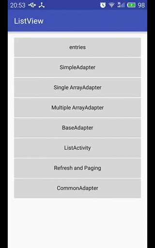
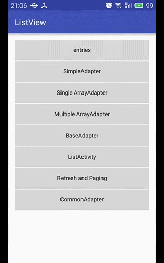
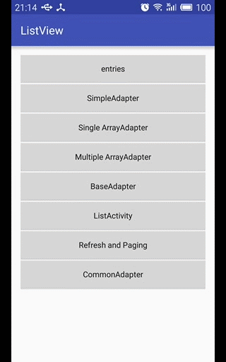
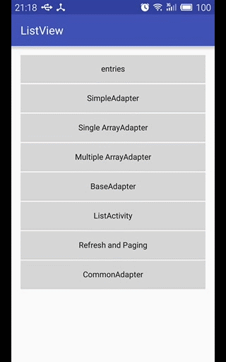
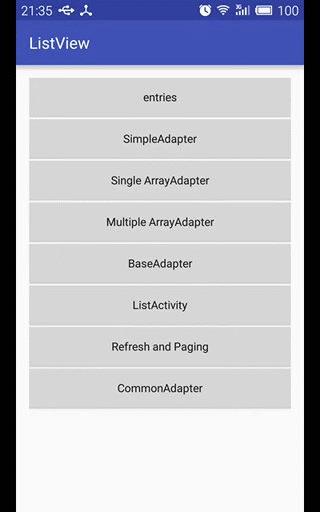
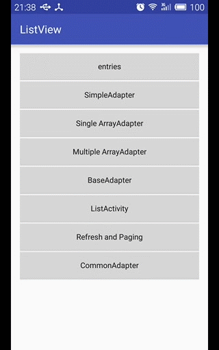
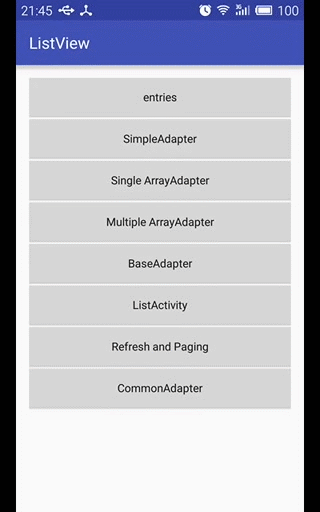
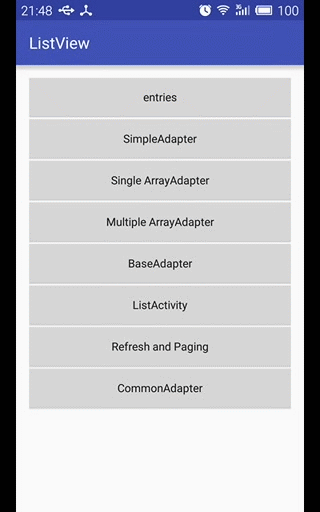

## ListView

|属性|描述|
|----|----|
|entries|ListView中的item数据集来源，默认ListView中的item为TextView|
|divider|ListView中item之间的分隔线颜色，需要配合dividerHeight才会生效，否则无效果 (@null表示不显示)|
|dividerHeight|ListView中item之间的分隔线高度|
|listSelector|ListView中的item被点击选中后的背景颜色|
|scrollbars|滚动条显示设置，none表示不显示|

## ListView的使用示例

**1. 使用XML属性entries来配置数据源**

xml布局代码：

```xml
<ListView
    android:id="@+id/lv_entries"
    android:layout_width="match_parent"
    android:layout_height="match_parent"
    android:divider="@color/colorSienna"
    android:dividerHeight="2dp"
    android:listSelector="@color/colorMediumPurple"
    android:entries="@array/names" />
```

java代码：

```java
ListView mEntriesLv = (ListView) findViewById(R.id.lv_entries);
mEntriesLv.setOnItemClickListener(new AdapterView.OnItemClickListener() {
    @Override
    public void onItemClick(AdapterView<?> parent, View view, int position, long id) {
        String names[] = getResources().getStringArray(R.array.names);
        Toast.makeText(EntriesActivity.this, names[position], Toast.LENGTH_SHORT).show();
    }
});
```

效果演示：




**2. 使用SimpleAdapter数据适配器**

simple_adapter_list_item.xml

```xml
<?xml version="1.0" encoding="utf-8"?>
<LinearLayout
    xmlns:android="http://schemas.android.com/apk/res/android"
    android:layout_width="match_parent"
    android:layout_height="wrap_content"
    android:gravity="center_vertical"
    android:padding="10dp" >

    <ImageView
        android:layout_width="wrap_content"
        android:layout_height="wrap_content"
        android:id="@+id/iv_item_icon"
        android:contentDescription="@null"
        android:src="@mipmap/ic_launcher"/>

    <TextView
        android:layout_width="wrap_content"
        android:layout_height="wrap_content"
        android:layout_marginStart="20dp"
        android:text="@string/text_hello_launcher"
        android:id="@+id/tv_item_title" />
</LinearLayout>
```

SimpleAdapter需要使用HashMap来保存ListView中item的每个控件的数据

```java
public class SimpleAdapterActivity extends AppCompatActivity {

    private Integer[] itemIconIds = {
            R.drawable.agnes_overjoyed_girl,
            R.drawable.angry_minion_cartoon,
            R.drawable.curious_minion_cartoon,
            R.drawable.dancing_minion_cartoon,
            R.drawable.despicable_me_minion_cartoon,
            R.drawable.happy_minion_cartoon,
            R.drawable.kungfu_minion_cartoon,
            R.drawable.shy_minion_cartoon
    };

    private String[] itemTitles = {
            "agnes_overjoyed_girl",
            "angry_minion_cartoon",
            "curious_minion_cartoon",
            "dancing_minion_cartoon",
            "despicable_me_minion_cartoon",
            "happy_minion_cartoon",
            "kungfu_minion_cartoon",
            "shy_minion_cartoon"
    };

    @Override
    protected void onCreate(Bundle savedInstanceState) {
        super.onCreate(savedInstanceState);
        setContentView(R.layout.activity_simple_adapter);

        ListView mSimpleAdapterLv = (ListView) findViewById(R.id.lv_simple_adapter);

        ArrayList<HashMap<String, Object>> itemsList = new ArrayList<>();
        for (int i = 0; i < itemIconIds.length; i++) {
            HashMap<String, Object> map = new HashMap<>();
            map.put("ItemIconId", itemIconIds[i]);
            map.put("ItemTitle", itemTitles[i]);
            itemsList.add(map);
        }

        SimpleAdapter adapter = new SimpleAdapter(
                this,                                               // Context context
                itemsList,                                          // List<? extends Map<String, ?>> data
                R.layout.simple_adapter_list_item,                  // int resId
                new String[]{"ItemIconId", "ItemTitle"},            // String[] from
                new int[]{R.id.iv_item_icon, R.id.tv_item_title}    // int[] to
        );

        mSimpleAdapterLv.setAdapter(adapter);

        mSimpleAdapterLv.setOnItemClickListener(new AdapterView.OnItemClickListener() {
            @Override
            public void onItemClick(AdapterView<?> parent, View view, int position, long id) {
                TextView tv = (TextView) view.findViewById(R.id.tv_item_title);
                Toast.makeText(SimpleAdapterActivity.this, tv.getText().toString(), Toast.LENGTH_SHORT).show();
            }
        });
    }
}
```

效果演示：




**3. 使用单选的ArrayAdapter数据适配器**

ListView中的item布局使用的是系统自带的：`android.R.layout.simple_list_item_single_choice`，并调用`ListView.setChoiceMode()`方法将选择模式设置为`ListView.CHOICE_MODE_SINGLE`。

```java
ListView mSingleArrayAdapterLv = (ListView) findViewById(R.id.lv_single_array_adapter);

String[] names = getResources().getStringArray(R.array.names);

// 单选模式
ArrayAdapter<String> adapter = new ArrayAdapter<String>(this, android.R.layout.simple_list_item_single_choice, names);
mSingleArrayAdapterLv.setChoiceMode(ListView.CHOICE_MODE_SINGLE);

mSingleArrayAdapterLv.setAdapter(adapter);
```

效果演示：




**4. 使用多选的ArrayAdapter数据适配器**

ListView中的item布局使用的是系统自带的：`android.R.layout.simple_list_item_multiple_choice`，并调用`ListView.setChoiceMode()`方法将选择模式设置为`ListView.CHOICE_MODE_MULTIPLE`。

```java
ListView mMultipleArrayAdapterLv = (ListView) findViewById(R.id.lv_multiple_array_adapter);

String[] names = getResources().getStringArray(R.array.names);

// 多选模式
ArrayAdapter<String> adapter = new ArrayAdapter<String>(this, android.R.layout.simple_list_item_multiple_choice, names);
mMultipleArrayAdapterLv.setChoiceMode(ListView.CHOICE_MODE_MULTIPLE);

mMultipleArrayAdapterLv.setAdapter(adapter);
```

效果演示：




**5. 使用BaseAdapter数据适配器**

ListView中的子项item布局：base_adapter_list_item.xml

```xml
<?xml version="1.0" encoding="utf-8"?>
<RelativeLayout xmlns:android="http://schemas.android.com/apk/res/android"
    android:layout_width="match_parent"
    android:layout_height="wrap_content"
    android:gravity="center_vertical"
    android:padding="10dp">

    <ImageView
        android:id="@+id/iv_user_icon"
        android:layout_width="60dp"
        android:layout_height="60dp"
        android:contentDescription="@null"
        android:src="@mipmap/ic_launcher" />

    <TextView
        android:id="@+id/tv_user_name"
        android:layout_width="match_parent"
        android:layout_height="30dp"
        android:layout_marginStart="20dp"
        android:layout_toEndOf="@id/iv_user_icon"
        android:gravity="center_vertical"
        android:text="@string/text_name"
        android:textSize="20sp" />

    <TextView
        android:id="@+id/tv_user_desc"
        android:layout_width="match_parent"
        android:layout_height="30dp"
        android:layout_marginStart="20dp"
        android:layout_below="@id/tv_user_name"
        android:layout_toEndOf="@id/iv_user_icon"
        android:gravity="center_vertical"
        android:text="@string/text_description"
        android:textSize="18sp" />
</RelativeLayout>
```

创建JavaBean对象UserBean，用于映射ListView子项中的数据项 UserBean.java

```java
public class UserBean {
    private int iconResId;
    private String name;
    private String description;

    public UserBean(){}

    public UserBean(int iconResId, String name, String description) {
        this.iconResId = iconResId;
        this.name = name;
        this.description = description;
    }

    public int getIconResId() {
        return iconResId;
    }

    public void setIconResId(int iconResId) {
        this.iconResId = iconResId;
    }

    public String getName() {
        return name;
    }

    public void setName(String name) {
        this.name = name;
    }

    public String getDescription() {
        return description;
    }

    public void setDescription(String description) {
        this.description = description;
    }

    @Override
    public String toString() {
        return "UserBean{" +
                "iconResId=" + iconResId +
                ", name='" + name + '\'' +
                ", description='" + description + '\'' +
                '}';
    }
}
```

自定义继承自BaseAdapter的数据适配器CustomBaseAdapter

ListView优化：通过convertView+ViewHolder来实现

ViewHolder优化BaseAdapter思路：

- 创建Bean对象，用于封装数据
- 在构造方法中初始化用于映射的数据List
- 创建ViewHolder类，创建布局映射关系
- 判断convertView，为空则创建，并设置tag，否则通过tag来取出ViewHolder
- 给ViewHolder中的控件设置数据

```java
public class CustomBaseAdapter extends BaseAdapter {

    private LayoutInflater inflater;
    private List<UserBean> mUserBeanList;

    public CustomBaseAdapter(Context context, List<UserBean> userBeanList) {
        mUserBeanList = userBeanList;
        inflater = LayoutInflater.from(context);
    }

    @Override
    public int getCount() {
        return mUserBeanList.size();
    }

    @Override
    public Object getItem(int position) {
        return mUserBeanList.get(position);
    }

    @Override
    public long getItemId(int position) {
        return position;
    }


    // 1. 利用了ListView的缓存特性，若没有缓存才创建新的View，避免了重复创建大量的convertView
    // 2. 通过ViewHolder类来实现显示数据的视图的缓存，避免多次通过findViewById寻找控件
    @Override
    public View getView(int position, View convertView, ViewGroup parent) {
        ViewHolder vh;
        if (convertView == null) {  // 如果缓存convertView为空，则需要创建View
            vh = new ViewHolder();

            // 根据上下文环境实例化一个布局文件base_adapter_list_item.xml
            convertView = inflater.inflate(R.layout.base_adapter_list_item, null);

            vh.iv_icon = (ImageView) convertView.findViewById(R.id.iv_user_icon);
            vh.tv_name = (TextView) convertView.findViewById(R.id.tv_user_name);
            vh.tv_desc = (TextView) convertView.findViewById(R.id.tv_user_desc);

            // 将ViewHolder关联到convertView中，避免下次从findViewById中查找控件
            convertView.setTag(vh);
        } else {
            vh = (ViewHolder) convertView.getTag();
        }

        UserBean user = mUserBeanList.get(position);
        vh.iv_icon.setImageResource(user.getIconResId());
        vh.tv_name.setText(user.getName());
        vh.tv_desc.setText(user.getDescription());

        return convertView;
    }

    // 创建静态内部类ViewHolder，用于缓存ListView中Item布局的每个控件
    // 一个ViewHolder对应ListView中的一个Item布局对象
    private static class ViewHolder {
        ImageView iv_icon;
        TextView tv_name;
        TextView tv_desc;
    }
}
```

自定义数据适配器的使用

```java
ListView mBaseAdapterLv = (ListView) findViewById(R.id.lv_base_adapter);

List<UserBean> mUserBeanList = new ArrayList<>();
for (int i = 0; i < 20; i++) {
    mUserBeanList.add(new UserBean(R.mipmap.ic_launcher, "Launcher - " + i, "I am Launcher - " + i));
}

CustomBaseAdapter adapter = new CustomBaseAdapter(this, mUserBeanList);
mBaseAdapterLv.setAdapter(adapter);

mBaseAdapterLv.setOnItemClickListener(new AdapterView.OnItemClickListener() {
    @Override
    public void onItemClick(AdapterView<?> parent, View view, int position, long id) {
        TextView tv_desc = (TextView) view.findViewById(R.id.tv_user_desc);
        Toast.makeText(BaseAdapterActivity.this, tv_desc.getText().toString(), Toast.LENGTH_SHORT).show();
    }
});
```

效果演示：




**6. 使用ListActivity**

```java
public class MyListActivity extends ListActivity {

    @Override
    protected void onCreate(Bundle savedInstanceState) {
        super.onCreate(savedInstanceState);
        // setContentView(R.layout.activity_list);

        ArrayAdapter adapter = ArrayAdapter.createFromResource(this, R.array.names, android.R.layout.simple_list_item_1);
        setListAdapter(adapter);
    }

    @Override
    protected void onListItemClick(ListView l, View v, int position, long id) {
        TextView tv = (TextView) v;
        Toast.makeText(this, tv.getText().toString(), Toast.LENGTH_SHORT).show();
    }
}
```

效果演示：




**7. 带刷新和加载页的ListView**

使用子线程来模拟网络耗时的数据请求，并通过Handler机制来通知主线程就行数据更新。

refresh_paging_list_item.xml

```xml
<?xml version="1.0" encoding="utf-8"?>
<LinearLayout
    xmlns:android="http://schemas.android.com/apk/res/android"
    android:orientation="horizontal"
    android:gravity="center_vertical"
    android:padding="16dp"
    android:layout_width="match_parent"
    android:layout_height="wrap_content">

    <TextView
        android:layout_width="wrap_content"
        android:layout_height="wrap_content"
        android:text="@string/text_the_news_title"
        android:id="@+id/tv_news_title" />

    <TextView
        android:layout_width="wrap_content"
        android:layout_height="wrap_content"
        android:text="@string/text_the_news_content"
        android:layout_marginStart="10dp"
        android:id="@+id/tv_news_content" />
</LinearLayout>
```

NewsBean.java

```java
public class NewsBean {
    private String title;
    private String content;

    public NewsBean() {
    }

    public NewsBean(String title, String content) {
        this.title = title;
        this.content = content;
    }

    public String getTitle() {
        return title;
    }

    public void setTitle(String title) {
        this.title = title;
    }

    public String getContent() {
        return content;
    }

    public void setContent(String content) {
        this.content = content;
    }

    @Override
    public String toString() {
        return "NewsBean{" +
                "title='" + title + '\'' +
                ", content='" + content + '\'' +
                '}';
    }
}
```

RefreshPagingActivity.java

```java
public class RefreshPagingActivity extends AppCompatActivity {

    private static final int MSG_UPDATE_DATA = 1;

    private List<NewsBean> mNewsBeanList = new ArrayList<>();
    private MyDataAdapter adapter;

    private int visibleLastItemIndex;       // 用于保存可显示的最后一条数据的索引

    @Override
    protected void onCreate(Bundle savedInstanceState) {
        super.onCreate(savedInstanceState);
        setContentView(R.layout.activity_refresh_paging);

        ListView mRefreshPagingLv = (ListView) findViewById(R.id.lv_refresh_paging);

        View footerView = getLayoutInflater().inflate(R.layout.loading, null);  // 实例化一个loading.xml布局文件
        mRefreshPagingLv.addFooterView(footerView);

        loadNews();

        adapter = new MyDataAdapter(this, mNewsBeanList);
        mRefreshPagingLv.setAdapter(adapter);

        mRefreshPagingLv.setOnScrollListener(new AbsListView.OnScrollListener() {
            @Override
            public void onScrollStateChanged(AbsListView view, int scrollState) {
                if((adapter.getCount() == visibleLastItemIndex) && (scrollState == AbsListView.OnScrollListener.SCROLL_STATE_IDLE)){
                    new Thread(new LoadingThread()).start();        // 启动子线程
                }
            }

            @Override
            public void onScroll(AbsListView view, int firstVisibleItem, int visibleItemCount, int totalItemCount) {
                visibleLastItemIndex = firstVisibleItem + visibleItemCount - 1;         // visibleLastItemIndex
            }
        });
    }

    private int index = 1;

    private void loadNews() {
        for (int i = 0; i < 12; i++) {
            NewsBean news = new NewsBean();
            news.setTitle("Title - " + index);
            news.setContent("The content - " + index);
            mNewsBeanList.add(news);
            index++;
        }
    }

    private Handler handler = new Handler(){
        @Override
        public void handleMessage(Message msg) {
            switch (msg.what){
                case MSG_UPDATE_DATA:
                    adapter.notifyDataSetChanged();     // 通知数据集改变消息
                    break;
            }
        }
    };


    private class LoadingThread implements Runnable{
        @Override
        public void run() {
            loadNews();                 // 生成另一页数据
            try {
                Thread.sleep(2000);     // 2sec
            } catch (InterruptedException e) {
                e.printStackTrace();
            }
            handler.sendEmptyMessage(MSG_UPDATE_DATA);  // 发送数据更新消息
        }
    }


    private class MyDataAdapter extends BaseAdapter {

        private LayoutInflater inflater;
        private List<NewsBean> mNewsBeanList;

        public MyDataAdapter(Context context, List<NewsBean> newsBeanList) {
            mNewsBeanList = newsBeanList;
            inflater = LayoutInflater.from(context);
        }

        @Override
        public int getCount() {
            return mNewsBeanList.size();
        }

        @Override
        public Object getItem(int position) {
            return mNewsBeanList.get(position);
        }

        @Override
        public long getItemId(int position) {
            return position;
        }

        @Override
        public View getView(int position, View convertView, ViewGroup parent) {
            ViewHolder holder;
            if (convertView == null) {
                holder = new ViewHolder();
                convertView = inflater.inflate(R.layout.refresh_paging_list_item, null);
                holder.tv_title = (TextView) convertView.findViewById(R.id.tv_news_title);
                holder.tv_content = (TextView) convertView.findViewById(R.id.tv_news_content);

                convertView.setTag(holder);
            } else {
                holder = (ViewHolder) convertView.getTag();
            }

            NewsBean news = mNewsBeanList.get(position);
            holder.tv_title.setText(news.getTitle());
            holder.tv_content.setText(news.getContent());

            return convertView;
        }

        private class ViewHolder {
            TextView tv_title;
            TextView tv_content;
        }
    }
}
```

效果演示：




**8. 重新封装的CommonAdapter公共数据适配器**

**CommonAdapter.java**

这里的数据适配器CommonAdapter中，将关于ListView的优化步骤封装在ViewHolder类中，并将控件与JavaBean数据关联步骤以抽象方法的方式让用户继承并自行实现关联。

```java
public abstract class CommonAdapter<T> extends BaseAdapter {
    private Context mContext;
    private List<T> mDataList;
    private int mLayoutId;

    public CommonAdapter(Context context, List<T> dataList, int layoutId){
        this.mContext = context;
        this.mDataList = dataList;
        this.mLayoutId = layoutId;
    }

    @Override
    public int getCount() {
        return mDataList.size();
    }

    @Override
    public T getItem(int position) {
        return mDataList.get(position);
    }

    @Override
    public long getItemId(int position) {
        return position;
    }

    @Override
    public View getView(int position, View convertView, ViewGroup parent){
        ViewHolder holder = ViewHolder.get(mContext, convertView, parent, mLayoutId);

        convert(holder, getItem(position));  // binding

        return holder.getConvertView();
    }

    // data binding between view and bean by user
    public abstract void convert(ViewHolder holder, T t);
}
```

**ViewHolder.java**

这里的ViewHolder类封装了在使用一般的继承BaseAdapter时的对于ListView的优化，即convertView和ViewHolder内部类。并提供了一些用于为特定控件设置值的API。

```java
public class ViewHolder {

    private SparseArray<View> mViewBuffer;       // mViewBuffer
    private View mConvertView;


    private ViewHolder(Context context, ViewGroup parent, int layoutId) {
        this.mViewBuffer = new SparseArray<>();
        mConvertView = LayoutInflater.from(context).inflate(layoutId, parent, false);
        mConvertView.setTag(this);              // View.setTag(ViewHolder);
    }

    public static ViewHolder get(Context context, View convertView, ViewGroup parent, int layoutId) {
        if (convertView == null) {
            return new ViewHolder(context, parent, layoutId);
        } else {
            return (ViewHolder) convertView.getTag();
        }
    }

    public View getView(int viewId) {
        View view = mViewBuffer.get(viewId);    // Firstly, get View from ViewBuffer by viewId
        if (view == null) {                     // Then, use View.findViewById(viewId) if null
            view = mConvertView.findViewById(viewId);
            mViewBuffer.put(viewId, view);      // Last, store the view into ViewBuffer
        }
        return view;
    }

    public View getConvertView() {
        return mConvertView;
    }

    //
    // setter() - supports chain programming
    //
    public ViewHolder setText(int viewId, String text) {
        TextView view = (TextView) getView(viewId);
        view.setText(text);
        return this;
    }

    public ViewHolder setImageResource(int viewId, int resId) {
        ImageView view = (ImageView) getView(viewId);
        view.setImageResource(resId);
        return this;
    }

    public ViewHolder setImageBitmap(int viewId, Bitmap bitmap) {
        ImageView view = (ImageView) getView(viewId);
        view.setImageBitmap(bitmap);
        return this;
    }

    public ViewHolder setImageURI(int viewId, Uri uri) {
        ImageView view = (ImageView) getView(viewId);
        view.setImageURI(uri);
        return this;
    }
}
```

**common_adapter_list_item.xml**

```xml
<?xml version="1.0" encoding="utf-8"?>
<RelativeLayout xmlns:android="http://schemas.android.com/apk/res/android"
    android:padding="10dp"
    android:descendantFocusability="blocksDescendants"
    android:layout_width="match_parent"
    android:layout_height="match_parent">

    <TextView
        android:id="@+id/id_title"
        android:layout_width="wrap_content"
        android:layout_height="wrap_content"
        android:singleLine="true"
        android:text="Android新技能"
        android:textColor="#444"
        android:textSize="16sp"/>

    <CheckBox
        android:id="@+id/id_check"
        android:layout_marginEnd="60dp"
        android:layout_alignParentEnd="true"
        android:layout_width="wrap_content"
        android:layout_height="wrap_content" />

    <TextView
        android:id="@+id/id_desc"
        android:layout_width="match_parent"
        android:layout_height="wrap_content"
        android:layout_below="@id/id_title"
        android:layout_marginTop="10dp"
        android:maxLines="2"
        android:minLines="1"
        android:text="Android打造万能的ListView和GridView适配器"
        android:textColor="#898989"
        android:textSize="16sp"/>

    <TextView
        android:id="@+id/id_time"
        android:layout_width="wrap_content"
        android:layout_height="wrap_content"
        android:layout_below="@id/id_desc"
        android:layout_marginTop="10dp"
        android:text="06/06/2016"
        android:textColor="#898989"
        android:textSize="12sp"/>

    <TextView
        android:id="@+id/id_phone"
        android:layout_width="wrap_content"
        android:layout_height="wrap_content"
        android:layout_alignParentEnd="true"
        android:layout_below="@id/id_desc"
        android:layout_marginTop="10dp"
        android:background="#20793d"
        android:padding="2dp"
        android:text="10086"
        android:maxLines="1"
        android:textColor="#FFF"
        android:textSize="12sp"/>
</RelativeLayout>
```

**Bean.java**

```java
public class Bean {
    private String title;
    private String desc;
    private String time;
    private String phone;

    private boolean isChecked;

    public Bean() {
    }

    public Bean(String title, String desc, String time, String phone) {
        this.title = title;
        this.desc = desc;
        this.time = time;
        this.phone = phone;
    }

    public String getTitle() {
        return title;
    }

    public void setTitle(String title) {
        this.title = title;
    }

    public String getDesc() {
        return desc;
    }

    public void setDesc(String desc) {
        this.desc = desc;
    }

    public String getTime() {
        return time;
    }

    public void setTime(String time) {
        this.time = time;
    }

    public String getPhone() {
        return phone;
    }

    public void setPhone(String phone) {
        this.phone = phone;
    }

    public boolean isChecked() {
        return isChecked;
    }

    public void setChecked(boolean checked) {
        isChecked = checked;
    }

    @Override
    public String toString() {
        return "Bean{" +
                "title='" + title + '\'' +
                ", desc='" + desc + '\'' +
                ", time='" + time + '\'' +
                ", phone='" + phone + '\'' +
                '}';
    }
}
```

**CustomCommonAdapter.java**

```java
public class CustomCommonAdapter extends CommonAdapter<Bean> {

    public CustomCommonAdapter(Context context, List<Bean> dataList, int layoutId) {
        super(context, dataList, layoutId);     // 必须调用父类构造器来初始化父类
    }

    @Override
    public void convert(ViewHolder holder, final Bean bean) { // 此方法由父类进行回调
        holder.setText(R.id.id_title, bean.getTitle())
                .setText(R.id.id_desc, bean.getDesc())
                .setText(R.id.id_time, bean.getTime())
                .setText(R.id.id_phone, bean.getPhone());

        final CheckBox cb = (CheckBox) holder.getView(R.id.id_check);
        cb.setChecked(bean.isChecked());        // 用于解决CheckBox复用上出现的重复问题
        cb.setOnClickListener(new View.OnClickListener() {
            @Override
            public void onClick(View v) {
                bean.setChecked(cb.isChecked());
            }
        });
    }
}
```

**CommonAdapterActivity.java**

```java
public class CommonAdapterActivity extends AppCompatActivity {

    private ListView mCommonAdapterLv;
    private List<Bean> mBeanList = new ArrayList<>();


    @Override
    protected void onCreate(Bundle savedInstanceState) {
        super.onCreate(savedInstanceState);
        setContentView(R.layout.activity_common_adapter);

        initDataList();
        initView();
    }

    private void initView() {
        mCommonAdapterLv = (ListView) findViewById(R.id.lv_common_adapter);
        CustomCommonAdapter adapter = new CustomCommonAdapter(this, mBeanList, R.layout.common_adapter_list_item);
        mCommonAdapterLv.setAdapter(adapter);
    }

    private void initDataList() {
        String title = "Android新技能 Get ";
        String desc = "Android打造万能ListView和GridView适配器";
        String time = "06/06/2016";
        String phone = "10086";
        for (int i = 1; i < 12; i++) {
            mBeanList.add(new Bean(title + i, desc, time, phone));
        }
    }
}
```

效果演示：




## Links

[Android 快速开发系列 打造万能的ListView GridView 适配器][1]

[1]: http://blog.csdn.net/lmj623565791/article/details/38902805/