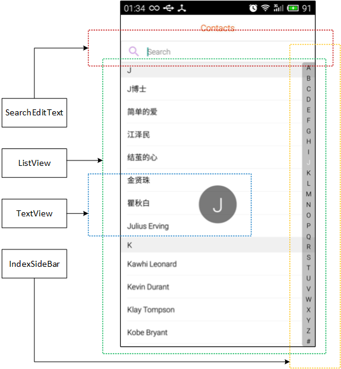
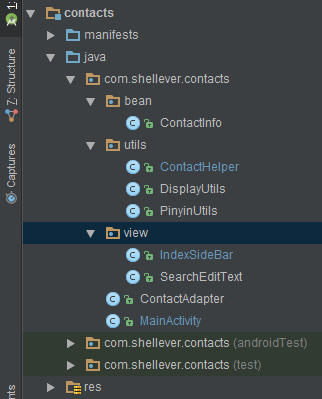
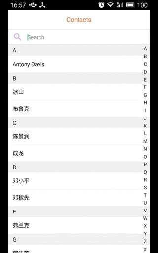
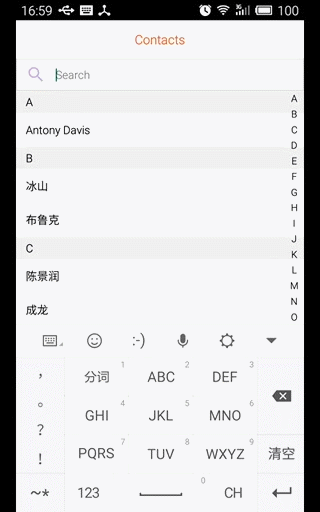

## 使用ListView实现排序搜索功能的联系人列表

#### 联系人列表模块图解

**主要分四个部分：**
1. SearchEditText - 用于搜索和过滤联系人的搜索框
2. ListView - 用于显示联系人列表信息的列表狂
3. IndexSideBar - 用于进行字母索引的侧边栏
4. TextView - 用于显示当前索引字母的文本框



#### 项目代码层次



#### 源码解析

**1. IndexSideBar.java**

IndexSideBar是继承自View的自定义视图控件，通过重写onSizeChanged()方法来获取宽度和高度，onDraw()方法用来绘制用于索引的字母，最重要的是重写触摸事件的分发dispatchTouchEvent()方法来对触摸事件进行处理，并内部定义了一个回调接口OnTouchLetterListener，用于回调外部事件处理方法。回调接口中包含有两个方法，其中onTouchingLetterListener()方法用于手指按下及滑动侧边栏事件的回调，而onTouchedLetterListener()方法用于手指从侧边栏抬起事件的回调。

```java
public class IndexSideBar extends View {

    private static final boolean DEBUG = false;

    private static String[] mLetterIndexArray = {
            "A", "B", "C", "D", "E", "F", "G", "H", "I",
            "J", "K", "L", "M", "N", "O", "P", "Q", "R",
            "S", "T", "U", "V", "W", "X", "Y", "Z", "#"
    };

    private List<String> mLetterIndexList;
    private int curLetterIndex = -1;    // current letter index
    private Paint mPaint;
    private Rect mTextBounds;

    private int mViewWidth;     // IndexSideBar width
    private int mViewHeight;    // IndexSideBar height


    public IndexSideBar(Context context) {
        this(context, null);
    }

    public IndexSideBar(Context context, AttributeSet attrs) {
        super(context, attrs);
        init();
    }

    private void init() {
        mLetterIndexList = Arrays.asList(mLetterIndexArray);    // String[] -> List
        mTextBounds = new Rect();
        mPaint = new Paint();       // Paint.ANTI_ALIAS_FLAG
        mPaint.setAntiAlias(true);
        mPaint.setTypeface(Typeface.SANS_SERIF);
        mPaint.setTextSize(DisplayUtils.sp2px(getContext(), 12));  // 12sp // 12dp

        setBackgroundColor(Color.alpha(0));
    }

    @Override
    protected void onSizeChanged(int w, int h, int oldw, int oldh) {
        mViewWidth = w;
        mViewHeight = h;
        if (DEBUG) {    // 72, 1581
            Toast.makeText(getContext(), "IndexSideBar: onSizeChanged()\n" + w + ", " + h, Toast.LENGTH_SHORT).show();
        }
    }

    @Override
    protected void onDraw(Canvas canvas) {
        if (DEBUG) {    // 72, 1581
            Toast.makeText(getContext(), "IndexSideBar: onDraw()\n" + getWidth() + ", " + getHeight(), Toast.LENGTH_SHORT).show();
        }

        int size = mLetterIndexList.size();
        float cellHeight = mViewHeight * 1.0f / size;

        for (int index = 0; index < size; index++) {
            mPaint.setColor(Color.BLACK);       // black
            if (index == curLetterIndex) {
                mPaint.setColor(Color.WHITE);   // white
            }
            String letter = mLetterIndexList.get(index);

            float xPos = (mViewWidth - mPaint.measureText(letter)) / 2;

            mPaint.getTextBounds(letter, 0, letter.length(), mTextBounds);
            int textHeight = mTextBounds.height();
            // baseline - left bottom, no left top
            float yPos = cellHeight / 2 + textHeight / 2 + cellHeight * index;

            // xPos - The x-coordinate of the origin of the text being drawn
            // yPos - The y-coordinate of the baseline of the text being drawn
            canvas.drawText(letter, xPos, yPos, mPaint);
        }
    }

    @Override
    public boolean dispatchTouchEvent(MotionEvent event) {
        float y = event.getY();
        int size = mLetterIndexList.size();
        int oldLetterIndex = curLetterIndex;
        int tmpLetterIndex = (int) (y / mViewHeight * size);

        if (event.getAction() == MotionEvent.ACTION_UP) {
            setBackgroundColor(Color.alpha(0));         // 设置背景为透明
            curLetterIndex = -1;
            invalidate();
            if (listener != null) {
                listener.onTouchedLetterListener();
            }
        } else {
            setBackgroundResource(R.drawable.bg_index_side_bar);    // 设置背景为指定样式
            if (tmpLetterIndex != oldLetterIndex) {
                if (tmpLetterIndex >= 0 && tmpLetterIndex < size) {
                    if (listener != null) {
                        listener.onTouchingLetterListener(mLetterIndexList.get(tmpLetterIndex));
                    }
                    curLetterIndex = tmpLetterIndex;
                    invalidate();
                }
            }
        }

        return true;
    }

    private OnTouchLetterListener listener;

    public void setOnTouchLetterListener(OnTouchLetterListener listener) {
        this.listener = listener;
    }
    
    // 触摸事件的回调接口定义
    public interface OnTouchLetterListener {
        void onTouchingLetterListener(String letter);

        void onTouchedLetterListener();
    }

    public void setLetterIndexList(List<String> list) {
        setLetterIndexList(list, true);
    }

    // 设置侧边栏的字母
    // perform为true时，表示接收外部传进的字母列表
    // perform为false时，表示放弃外部传进的字母列表，使用默认的字母列表
    public void setLetterIndexList(List<String> list, boolean perform) {
        mLetterIndexList = perform ? list : Arrays.asList(mLetterIndexArray);
        invalidate();
    }
}
```

其中定义的侧边栏样式如下：

```xml
<?xml version="1.0" encoding="utf-8"?>
<shape xmlns:android="http://schemas.android.com/apk/res/android"
    android:shape="rectangle" >

    <solid
        android:color="#3E000000"/>

    <corners
        android:bottomLeftRadius="4dp"
        android:topLeftRadius="4dp" />

</shape>
```

**2. SearchEditText.java**

SearchEditText是直接继承自EditText的自定义视图控件，实现了点击右侧删除图片来删除内容的功能。并定义了一个继承自TextWatcher的内部类MiddleTextWatcher来减少重写TextWatcher时不必要的代码。

```java
public class SearchEditText extends EditText {

    private static boolean DEBUG = false;

    private Drawable mSearchDrawable;
    private Drawable mDeleteDrawable;

    public SearchEditText(Context context) {
        this(context, null);
    }

    public SearchEditText(Context context, AttributeSet attrs) {
        super(context, attrs);
        init();
    }

    private void init() {
        mSearchDrawable = getCompoundDrawables()[0];    // left top right bottom
        if (mSearchDrawable == null) {
            mSearchDrawable = ContextCompat.getDrawable(getContext(), R.drawable.ic_action_search);
        }
        int mIntrinsicWidth = mSearchDrawable.getIntrinsicWidth();
        int mIntrinsicHeight = mSearchDrawable.getIntrinsicHeight();
        int width = (int) (mIntrinsicWidth * 0.8f);     // scale
        int height = (int) (mIntrinsicHeight * 0.8f);   // scale
        mSearchDrawable.setBounds(0, 0, width, height);

        if(DEBUG) {
            Locale locale = Locale.getDefault();
            String info = String.format(locale, "[(%d, %d), (%d, %d)]", mIntrinsicWidth, mIntrinsicHeight, width, height);
            Toast.makeText(getContext(), info, Toast.LENGTH_SHORT).show();  // (96, 96), (76, 76)
        }

        mDeleteDrawable = getCompoundDrawables()[2];    // left top right bottom
        if (mDeleteDrawable == null) {
            mDeleteDrawable = ContextCompat.getDrawable(getContext(), R.drawable.ic_action_delete);
        }
        mIntrinsicWidth = mDeleteDrawable.getIntrinsicWidth();
        mIntrinsicHeight = mDeleteDrawable.getIntrinsicHeight();
        width = (int) (mIntrinsicWidth * 0.8f);
        height = (int) (mIntrinsicHeight * 0.8f);
        mDeleteDrawable.setBounds(0, 0, width, height);

        setDeleteDrawable(false);
        addTextChangedListener(new MiddleTextWatcher() {
            @Override
            public void onTextChanged(CharSequence s, int start, int before, int count) {
                setDeleteDrawable(s.length() > 0);
            }
        });
        setOnFocusChangeListener(new OnFocusChangeListener() {
            @Override
            public void onFocusChange(View v, boolean hasFocus) {
                boolean visible = hasFocus && (getText().length() > 0);
                setDeleteDrawable(visible);
            }
        });
    }

    private void setDeleteDrawable(boolean visible) {
        Drawable right = visible ? mDeleteDrawable : null;
        setCompoundDrawables(mSearchDrawable, null, right, null);   // firstly, setBounds()
//        setCompoundDrawablesWithIntrinsicBounds(mSearchDrawable, null, right, null); // IntrinsicBounds
    }

    @Override
    public boolean onTouchEvent(MotionEvent event) {
        if (mDeleteDrawable != null && event.getAction() == MotionEvent.ACTION_UP) {
            int left = getWidth() - getPaddingRight() - mDeleteDrawable.getIntrinsicWidth();
            int right = getWidth() - getPaddingRight();
            if(DEBUG) {
                Toast.makeText(getContext(), "left, right = " + left + ", " + right, Toast.LENGTH_SHORT).show();
            }
            if (event.getX() >= left && event.getX() <= right) {
                this.setText("");
            }
            // getRawX/getRawY - no right
//            int eventX = (int) event.getRawX();
//            int eventY = (int) event.getRawY();
//            Toast.makeText(getContext(), "eventX, eventY = " + eventX + ", " + eventY, Toast.LENGTH_SHORT).show();
//            Rect rect = new Rect();
//            getGlobalVisibleRect(rect);         //
//            rect.left = rect.right - 50;
//            if(rect.contains(eventX, eventY)){
//                setText("");
//            }
        }

        return super.onTouchEvent(event);
    }

    public static class MiddleTextWatcher implements TextWatcher {
        @Override
        public void beforeTextChanged(CharSequence s, int start, int count, int after) {

        }

        @Override
        public void onTextChanged(CharSequence s, int start, int before, int count) {

        }

        @Override
        public void afterTextChanged(Editable s) {

        }
    }
}
```

**3. ContactInfo.java**

ContactInfo类是一个用于保存联系人信息的JavaBean，其中的pinyinName属性用于搜索时过滤联系人，sortLetters属性用于联系人的分类标识。由于此项目中的列表只显示一个联系人名称，故只定义了一个属性rawName来保存原本的名称。如果在ListView中的item布局中需要类似图片头像显示等多个控件的，则只需要将rawName属性改为对应的JavaBean，即在ContactInfo中包含有自定义的JavaBean属性。
ContactInfo类实现了一个比较接口Comparable，用来进行排序功能，而排序的依据是根据sortLetters属性来进行的。

```java
public class ContactInfo implements Comparable<ContactInfo> {

    private String rawName;             // raw
    private String pinyinName;          // filter
    private String sortLetters;         // sort

    public ContactInfo() {
    }

    public ContactInfo(String rawName, String pinyinName, String sortLetters) {
        this.rawName = rawName;
        this.pinyinName = pinyinName;
        this.sortLetters = sortLetters;
    }

    public String getRawName() {
        return rawName;
    }

    public void setRawName(String rawName) {
        this.rawName = rawName;
    }

    public String getPinyinName() {
        return pinyinName;
    }

    public void setPinyinName(String pinyinName) {
        this.pinyinName = pinyinName;
    }

    public String getSortLetters() {
        return sortLetters;
    }

    public void setSortLetters(String sortLetters) {
        this.sortLetters = sortLetters;
    }

    @Override
    public int compareTo(@NonNull ContactInfo another) {
        if (sortLetters.startsWith("#")) {
            return 1;
        } else if (another.getSortLetters().startsWith("#")) {
            return -1;
        } else {
            return sortLetters.compareTo(another.getSortLetters());
        }
    }

    @Override
    public String toString() {
        return "ContactInfo{" +
                "rawName='" + rawName + '\'' +
                ", pinyinName='" + pinyinName + '\'' +
                ", sortLetters='" + sortLetters + '\'' +
                '}';
    }
}
```

**4. ContactHelper.java**

ContactHelper类定义了一些用于建立联系人列表的静态方法：

- **contactsFilter()** - 根据过滤字符串来得到过滤后的联系人列表
- **setupLetterIndexList()** - 创建侧边栏中的字母索引
- **setupContactInfoList()** - 创建联系人列表的信息
- **setupSortLetters()** - 创建用于排序的字母串：默认返回的字符串全部为大写字母或者#

```java
public class ContactHelper {

    public static List<ContactInfo> contactsFilter(String filterStr, List<ContactInfo> contactInfoList) {
        List<ContactInfo> mFilterList = new ArrayList<>();
        if (TextUtils.isEmpty(filterStr)) {     // 若过滤字符为空，则直接返回所有列表信息
            mFilterList = contactInfoList;
        } else {
            mFilterList.clear();
            for (ContactInfo contactInfo : contactInfoList) {
                String upperFilterStr = filterStr.toUpperCase();
                String rawName = contactInfo.getRawName();
                String pinyinName = contactInfo.getPinyinName();
                // 联系人姓名中是否包含此搜索的过滤字符串
                // 或者联系人姓名的拼音字符串是否以搜索的过滤字符串为开头
                if (rawName.toUpperCase().contains(upperFilterStr)
                        || pinyinName.startsWith(upperFilterStr)) {
                    mFilterList.add(contactInfo);
                }
            }
        }
        Collections.sort(mFilterList);      // 排序
        return mFilterList;
    }

    // 创建侧边栏中的字母索引
    public static List<String> setupLetterIndexList(List<ContactInfo> contactInfoList) {
        List<String> mLetterIndexList = new ArrayList<>();
        boolean found = false;
        for (ContactInfo contactInfo : contactInfoList) {
            String firstLetter = contactInfo.getSortLetters().substring(0, 1);
            if (!mLetterIndexList.contains(firstLetter) && !"#".equals(firstLetter)) {
                mLetterIndexList.add(firstLetter);
            }
            if (!found && "#".equals(firstLetter)) {    // 只要找到#字符就不再进行判断
                found = true;
            }
        }
        Collections.sort(mLetterIndexList);     // 排序
        if (found) {                            // 若发现有"#"
            mLetterIndexList.add("#");          // 则只在列表最后添加"#"
        }
        return mLetterIndexList;
    }

    // 创建联系人列表的信息
    public static List<ContactInfo> setupContactInfoList(String[] contacts) {
        List<ContactInfo> results = new ArrayList<>();
        for (String contact : contacts) {
            ContactInfo contactInfo = new ContactInfo();
            contactInfo.setRawName(contact);        // rawName

            // 只会对中文转成的汉字拼音进行大写处理
            String pinyinName = PinyinUtils.toPinyinString(contact, PinyinUtils.CASE_UPPERCASE);
            pinyinName = pinyinName.toUpperCase();  // 若包含英文字母则额外再进行大写处理
            contactInfo.setPinyinName(pinyinName);  // pinyinName

            String sortLetters = setupSortLetters(contact);
            contactInfo.setSortLetters(sortLetters); // sortLetters

            results.add(contactInfo);
        }
        Collections.sort(results);  // 排序
        return results;
    }

    // 创建用于排序的字母串：默认返回的字符串全部为大写字母或者#
    // 规则定义：
    // 汉字开头时，只取第一个汉字的拼音；
    // 英文开头时，只截取从开头到非字母字符之前的字母
    private static String setupSortLetters(String contact) {
        String firstChar = String.valueOf(contact.charAt(0));   // 获取第一个字符
        int mode = PinyinUtils.CASE_UPPERCASE | PinyinUtils.TRIM_NON_CHAR;
        String pinyin = PinyinUtils.toPinyinString(firstChar, mode);
        if (!TextUtils.isEmpty(pinyin)) {       // 首个字符是汉字 (简单的爱)
            return pinyin;                      // JIAN
        } else {
            String words = contact.split("[^a-zA-Z]")[0]; // 或者以英文串开头 (q$100w)
            if (!TextUtils.isEmpty(words)) {
                return words.toUpperCase();               // Q
            } else {                // 其他的字符归类到#中 ($$Mr.Dj)
                return "#";         // #
            }
        }
    }
}
```

**5. DisplayUtils.java**

DisplayUtils类中定义了用于将dip/sp转成px的方法，主要用于自定义控件的使用。

```java
public class DisplayUtils {
    public static float dp2px(Context context, int dip) {
        DisplayMetrics dm = context.getResources().getDisplayMetrics();
        return TypedValue.applyDimension(TypedValue.COMPLEX_UNIT_DIP, dip, dm);
    }

    public static float sp2px(Context context, int sp){
        DisplayMetrics dm = context.getResources().getDisplayMetrics();
        return TypedValue.applyDimension(TypedValue.COMPLEX_UNIT_SP, sp, dm);
    }
}
```

**6. PinyinUtils.java**

PinyinUtils是一个汉字转拼音的工具类，详细可以查看这里 **[汉字转拼音HanziToPinyin](http://www.jianshu.com/p/8e3c1f4c8077)**

**7. ContactAdapter.java**

ContactAdapter继承自BaseAdapter并实现了SectionIndexer接口，其中SectionIndexer接口中定义的方法说明如下：

- getSectionForPosition() - 获取指定位置position的用于排序的字符串的首字母section
- getPositionForSection() - 根据首字母section来获取第一次出现的位置position

```java
//
// position     letters     section
// 0            adventure   0 / a
// 1            advance     0 / a
// 2            boy         1 / b
// 3            box         1 / b
//
// position => section  : getSectionForPosition()
// section  => position : getPositionForSection()
//
```

ContactAdapter源码如下：

```java
public class ContactAdapter extends BaseAdapter implements SectionIndexer {

    private static boolean DEBUG = false;

    private LayoutInflater inflater;
    private List<ContactInfo> mContactInfoList;

    public ContactAdapter(Context context, List<ContactInfo> list) {
        mContactInfoList = list;
        inflater = LayoutInflater.from(context);
    }

    @Override
    public int getCount() {
        return mContactInfoList.size();
    }

    @Override
    public Object getItem(int position) {
        return mContactInfoList.get(position);
    }

    @Override
    public long getItemId(int position) {
        return position;
    }

    @Override
    public View getView(int position, View convertView, ViewGroup parent) {
        ViewHolder holder;
        if (convertView == null) {
            holder = new ViewHolder();
            convertView = inflater.inflate(R.layout.contact_list_item, null);
            holder.tv_letter = (TextView) convertView.findViewById(R.id.tv_contact_index_letter);
            holder.tv_name = (TextView) convertView.findViewById(R.id.tv_contact_name);
            convertView.setTag(holder);
        } else {
            holder = (ViewHolder) convertView.getTag();
        }

        ContactInfo contactInfo = mContactInfoList.get(position);

        int section = getSectionForPosition(position);
        int startSectionPosition = getPositionForSection(section);
        if (position == startSectionPosition) {
            holder.tv_letter.setVisibility(View.VISIBLE);
            holder.tv_letter.setText(String.valueOf(contactInfo.getSortLetters().charAt(0)));  // error: contactInfo.getSortLetters().charAt(0)
        } else {
            holder.tv_letter.setVisibility(View.GONE);
        }

        if (DEBUG) {
            holder.tv_name.setText(contactInfo.getRawName() + " -> " + contactInfo.getPinyinName());
        } else {
            holder.tv_name.setText(contactInfo.getRawName());
        }

        return convertView;
    }

    private class ViewHolder {
        TextView tv_letter;
        TextView tv_name;
    }

    //
    // position     letters     section
    // 0            adventure   0 / a
    // 1            advance     0 / a
    // 2            boy         1 / b
    // 3            box         1 / b
    //
    // position => section  : getSectionForPosition
    // section  => position : getPositionForSection
    //
    @Override
    public Object[] getSections() {
        return null;
    }

    @Override
    public int getPositionForSection(int section) {
        for (int i = 0; i < getCount(); i++) {
            if (section == getSectionForPosition(i)) {
                return i;
            }
        }
        return -1;
    }

    @Override
    public int getSectionForPosition(int position) {
        return mContactInfoList.get(position).getSortLetters().charAt(0);
    }

    public void updateContactInfoList(List<ContactInfo> list) {
        mContactInfoList = list;
        notifyDataSetChanged();
    }
}
```

**8. activity_main.xml**

```xml
<?xml version="1.0" encoding="utf-8"?>
<LinearLayout xmlns:android="http://schemas.android.com/apk/res/android"
    xmlns:tools="http://schemas.android.com/tools"
    android:layout_width="match_parent"
    android:layout_height="match_parent"
    android:background="@color/colorWhite"
    android:orientation="vertical">

    <RelativeLayout
        android:layout_width="match_parent"
        android:layout_height="48dp">

        <TextView
            android:id="@+id/tv_contacts_title"
            android:layout_width="wrap_content"
            android:layout_height="wrap_content"
            android:layout_centerInParent="true"
            android:text="@string/app_name"
            android:textColor="@color/colorOrangeRed"
            android:textSize="16sp" />
    </RelativeLayout>

    <com.shellever.contacts.view.SearchEditText
        android:id="@+id/et_contacts_search"
        android:layout_width="match_parent"
        android:layout_height="40dp"
        android:background="@drawable/bg_action_search"
        android:drawablePadding="12dp"
        android:hint="@string/text_hint_search"
        android:maxLines="1"
        android:paddingLeft="12dp"
        android:paddingRight="12dp"
        android:textSize="14sp" />

    <FrameLayout
        android:layout_width="match_parent"
        android:layout_height="match_parent">

        <ListView
            android:id="@+id/lv_contacts"
            android:layout_width="match_parent"
            android:layout_height="match_parent"
            android:layout_gravity="center"
            android:divider="@null"
            android:scrollbars="none" />

        <TextView
            android:id="@+id/tv_letter_dialog"
            android:layout_width="70dp"
            android:layout_height="70dp"
            android:layout_gravity="center"
            android:background="@drawable/bg_letter_dialog"
            android:gravity="center"
            android:text="@string/text_contact_index_letter"
            android:textColor="@color/colorWhite"
            android:textSize="36sp"
            android:visibility="gone"
            tools:visibility="visible" />

        <com.shellever.contacts.view.IndexSideBar
            android:id="@+id/sb_index_letter"
            android:layout_width="24dp"
            android:layout_height="match_parent"
            android:layout_gravity="end|center" />
    </FrameLayout>

</LinearLayout>
```

**9. MainActivity.java**

MainActivity中很简单，初始化各种控件，然后设置事件监听，包括设置联系人列表的点击事件监听、侧边栏的触摸事件监听、搜索框的文本内容改变事件监听，最后设置ListView和IndexSideBar中的数据源。

```java
public class MainActivity extends Activity {

    private static boolean DEBUG = false;

    private ListView mContactsLv;
    private IndexSideBar mIndexSideBar;
    private ContactAdapter mContactAdapter;
    private SearchEditText mSearchEt;
    private List<ContactInfo> mContactInfoList;
    private TextView mLetterDialogTv;

    @Override
    protected void onCreate(Bundle savedInstanceState) {
        super.onCreate(savedInstanceState);
        setContentView(R.layout.activity_main);

        initViews();            // 初始化控件
        initEvents();           // 设置事件监听
        initContactAdapter();   // 设置数据源
    }

    private void initViews() {
        mSearchEt = (SearchEditText) findViewById(R.id.et_contacts_search);
        mLetterDialogTv = (TextView) findViewById(R.id.tv_letter_dialog);
        mIndexSideBar = (IndexSideBar) findViewById(R.id.sb_index_letter);
        mContactsLv = (ListView) findViewById(R.id.lv_contacts);
    }

    private void initEvents() {
        // 设置联系人列表的点击事件监听
        mContactsLv.setOnItemClickListener(new AdapterView.OnItemClickListener() {
            @Override
            public void onItemClick(AdapterView<?> parent, View view, int position, long id) {
                ContactInfo contactInfo = (ContactInfo) mContactAdapter.getItem(position);
                Toast.makeText(MainActivity.this, contactInfo.getRawName(), Toast.LENGTH_SHORT).show();
            }
        });

        // 设置侧边栏的触摸事件监听
        mIndexSideBar.setOnTouchLetterListener(new IndexSideBar.OnTouchLetterListener() {
            @Override
            public void onTouchingLetterListener(String letter) {
                mLetterDialogTv.setText(letter);
                mLetterDialogTv.setVisibility(View.VISIBLE);

                int position = mContactAdapter.getPositionForSection(letter.charAt(0));
                if (position != -1) {
                    mContactsLv.setSelection(position);     // jump to the specified position
                }
            }

            @Override
            public void onTouchedLetterListener() {
                mLetterDialogTv.setVisibility(View.GONE);
            }
        });

        // 设置搜索框的文本内容改变事件监听
        mSearchEt.addTextChangedListener(new SearchEditText.MiddleTextWatcher() {
            @Override
            public void onTextChanged(CharSequence s, int start, int before, int count) {
                List<ContactInfo> mFilterList = ContactHelper.contactsFilter(s.toString(), mContactInfoList);
                mContactAdapter.updateContactInfoList(mFilterList); // update
                if (DEBUG) {
                    Toast.makeText(MainActivity.this, s.toString(), Toast.LENGTH_SHORT).show();
                }
            }
        });
    }

    private void initContactAdapter() {
        String[] contacts = getResources().getStringArray(R.array.contacts);
        mContactInfoList = ContactHelper.setupContactInfoList(contacts);

        // 设置侧边栏中的字母索引
        List<String> mLetterIndexList = ContactHelper.setupLetterIndexList(mContactInfoList);
        mIndexSideBar.setLetterIndexList(mLetterIndexList, false);

        // 设置联系人列表的信息
        mContactAdapter = new ContactAdapter(this, mContactInfoList);
        mContactsLv.setAdapter(mContactAdapter);
    }

}
```


#### 侧边栏效果演示



####搜索框效果演示



## Links

[Android 实现ListView的A-Z字母排序和过滤搜索功能，实现汉字转成拼音][1]
[Android事件分发机制完全解析，带你从源码的角度彻底理解(上)][2]
[Android事件分发机制完全解析，带你从源码的角度彻底理解(下)][3]
[Android事件传递机制][4]

[1]: http://blog.csdn.net/xiaanming/article/details/12684155
[2]: http://blog.csdn.net/sinyu890807/article/details/9097463
[3]: http://blog.csdn.net/sinyu890807/article/details/9153747
[4]: http://ryantang.me/blog/2014/01/02/android-event-dispatch/